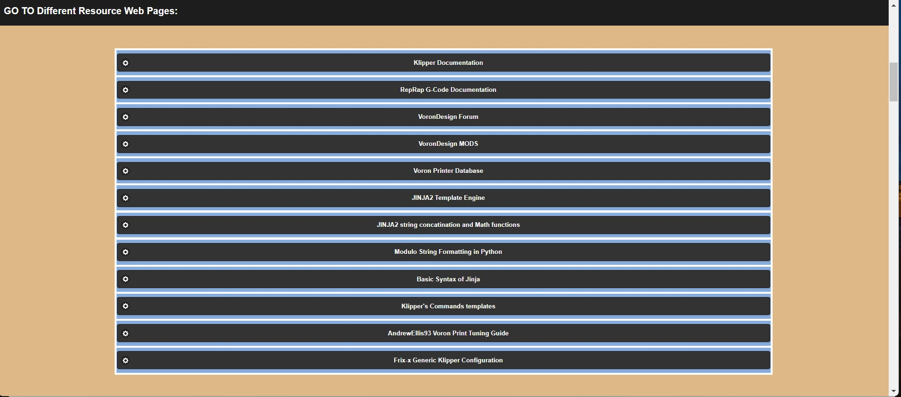
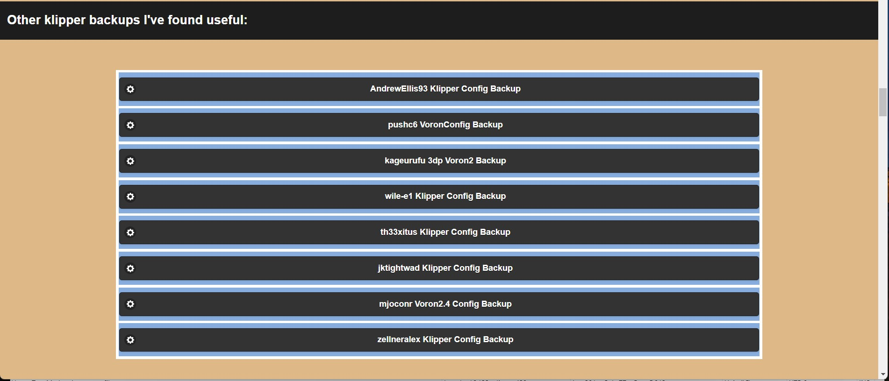
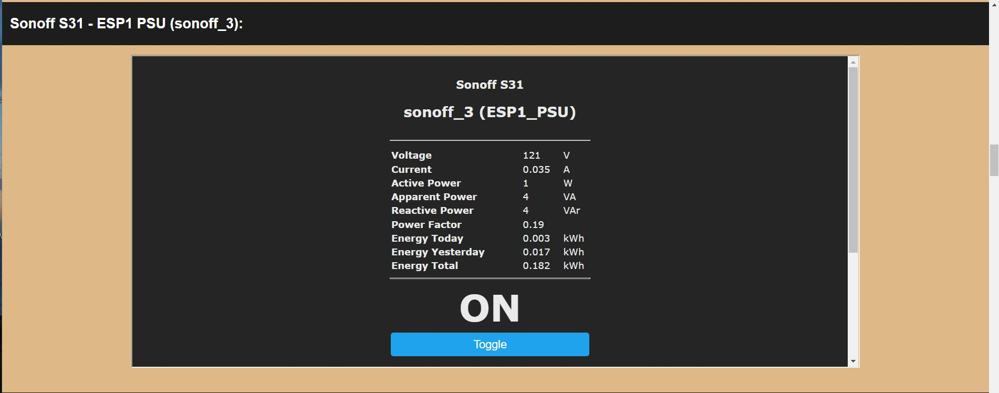
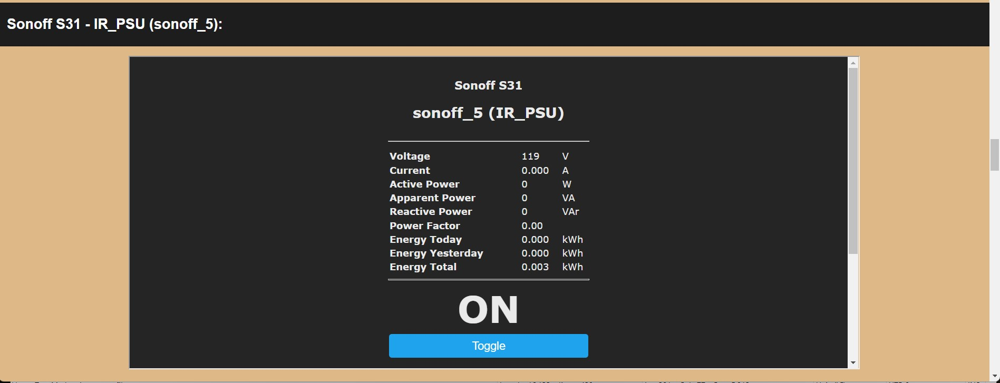
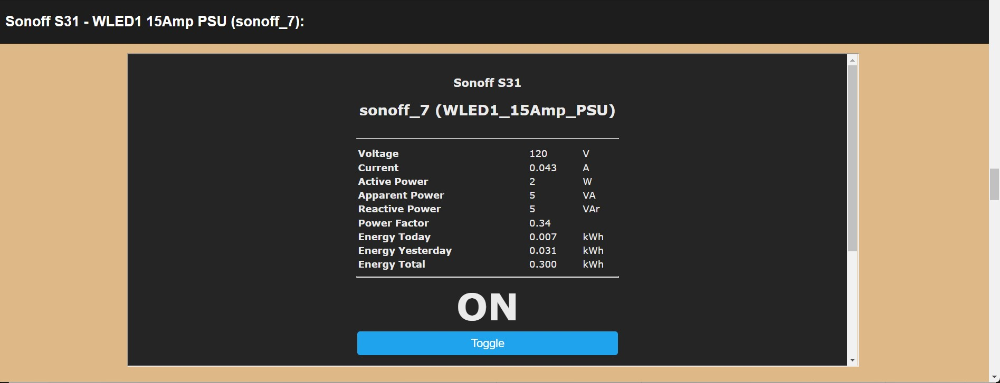
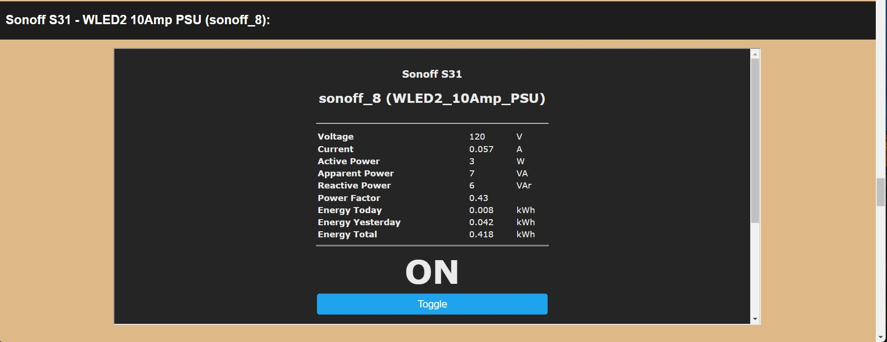
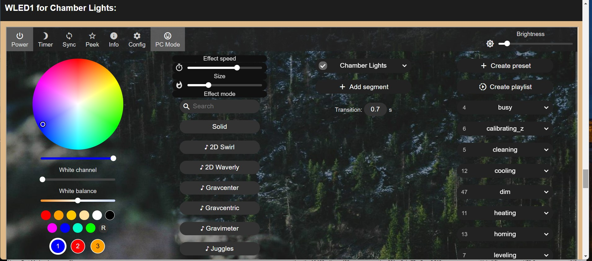
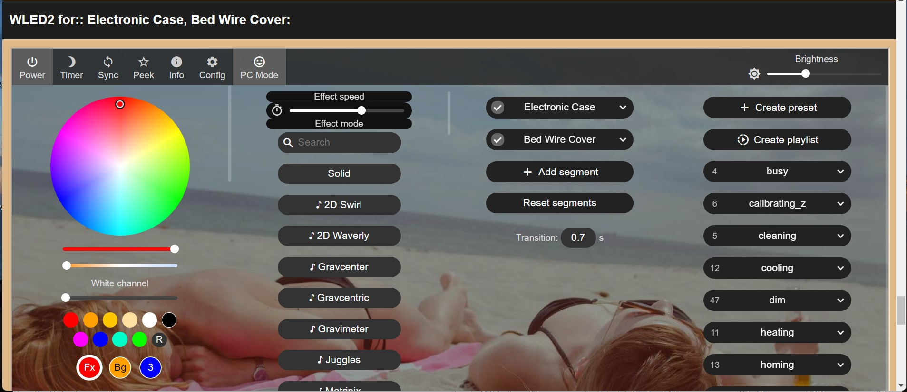
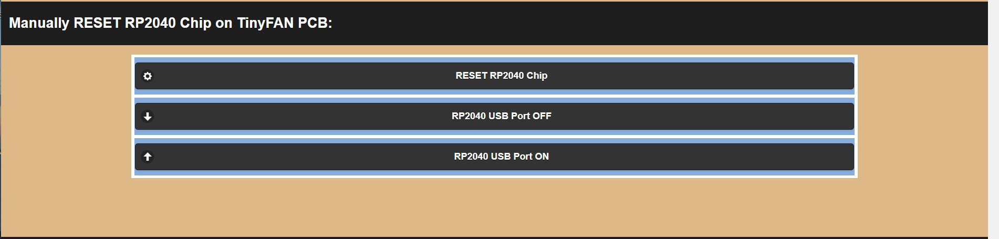
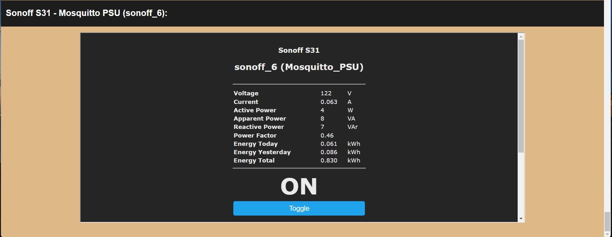

# Klipper backup of the LDO 300 Kit Build Web Page Server
Backup for configuration files for the LDO 300 Kit Build Web Page

---

The Index.html file is the page that is displayed for the LDO 300 Kit build.

The following pictures shows you how the LDO 300 Kit web page looks like:

