# Klipper Backup of the "LDO 300 Kit" Web Page Server

Backup for configuration files for the "LDO 300 Kit" Build 

---

The Index.html file is the page that is displayed for the LDO 300 Kit build.

I have now added the ability to send MQTT commands to all 10 of my separate power supplies that are hooked to my LDO 300 mm kit Build to either boot up of shutdown.

I tried using the Moonraker's "off_when_shutdown:" and "off_when_shutdown_delay" options for the power devices, but I could not get them to work!

After some reading I determined that they work if "Klipper goes into a shutdown state".  That is not the same thing as sending the machine object the command to shut down!

Apparently Klipper will go into a shutdown state when it looses communication with a mcu.  Well if I can not get Klipper to trigger the shutdown state externally then I can not use it. 

So I decided that I would handle the shutdown programmatically.  I was able to find the moonraker commands to tell Klipper service to shut down and to turn off the machine.  All my separate power supplies are on Sonoff 31 Tasmota firmware smart plugs, so they will talk MQTT protocol.

So I decided to control the printer will MQTT protocol from one Raspberry Pi running Mosquito server to my Klipper server running my LDO 300 kit.

A print farm could use this idea, so you could control all your printers from one web page.

The hard part was getting the NGINX web server setup to allow CORS communications.  Since I am talking from one domain server to another domain server.

It took me 4 days to get everything working.  So now I can press a button on my web page, and it will slowly bring down my printer.  I have another button that allows me to boot up the printer and open the UI web page for me automatically.

---

Here are the pictures showing the buttons:

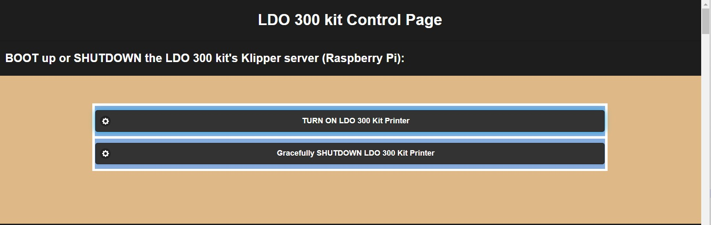

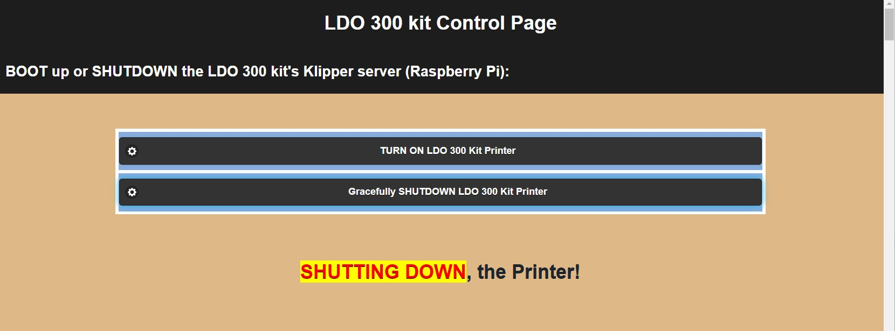

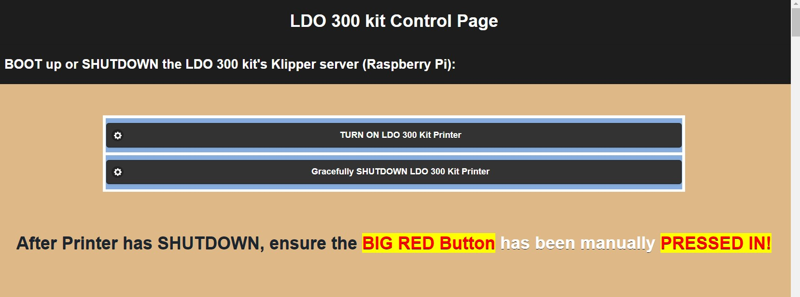

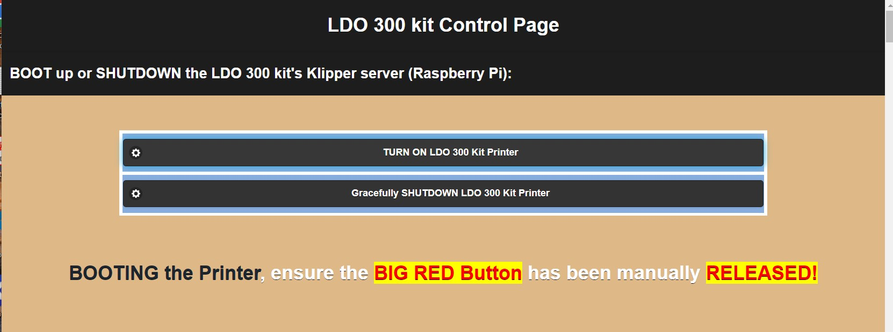

---

The following pictures show you how the LDO 300 Kit web page looks like:

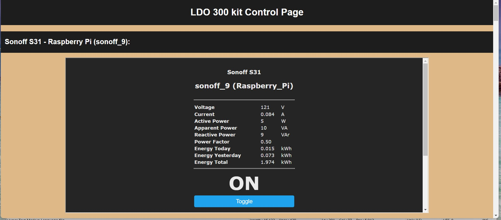

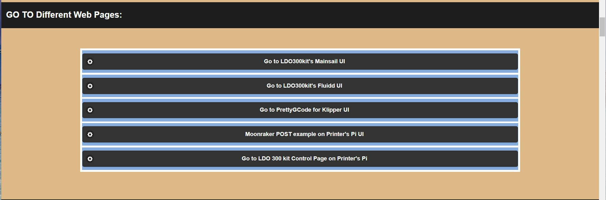

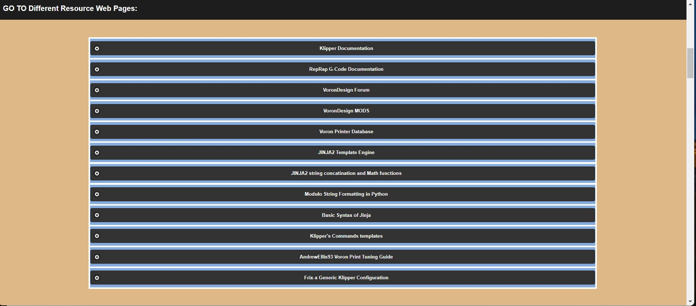

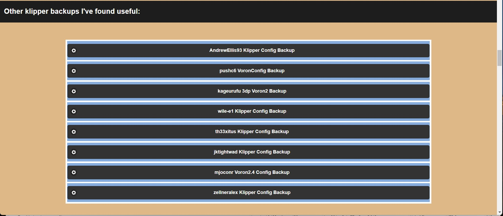

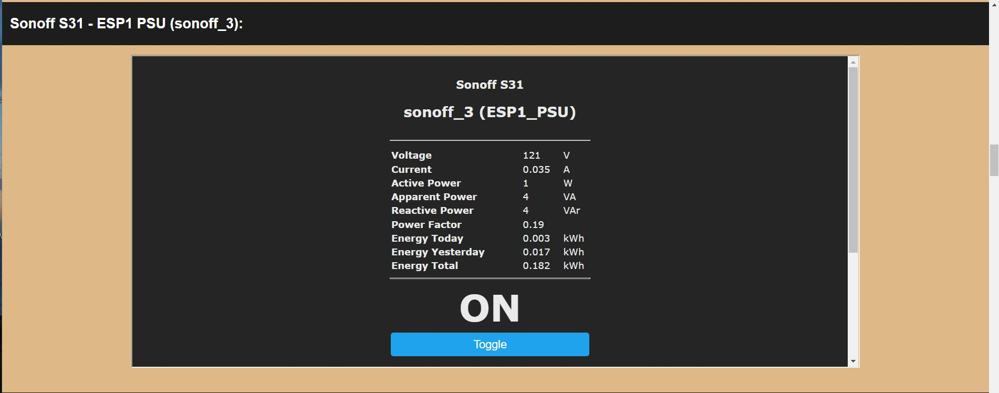

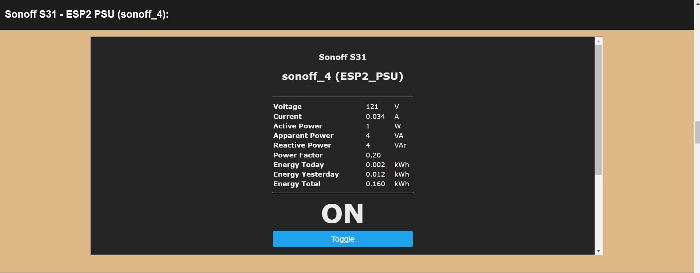

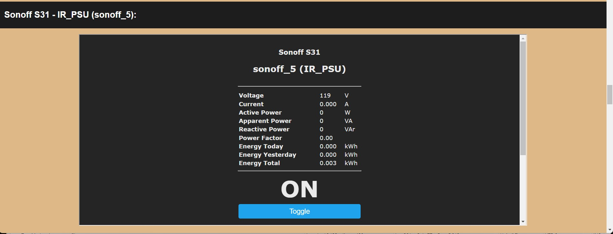

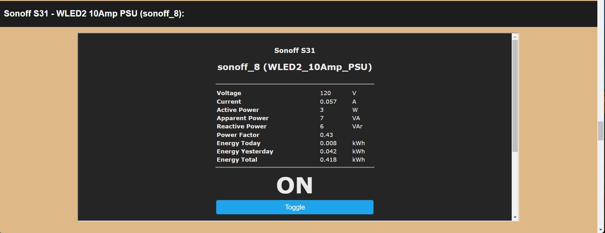

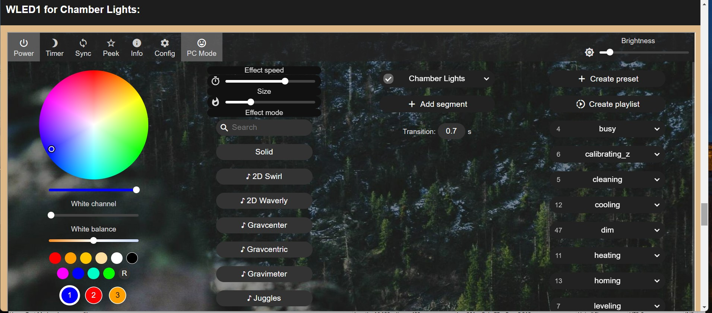

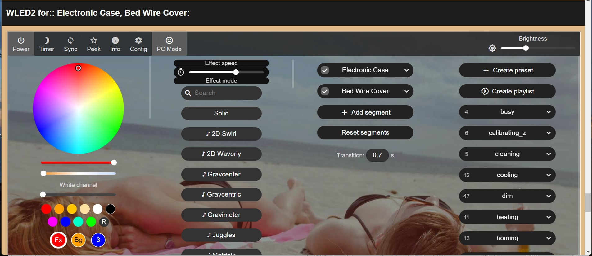

