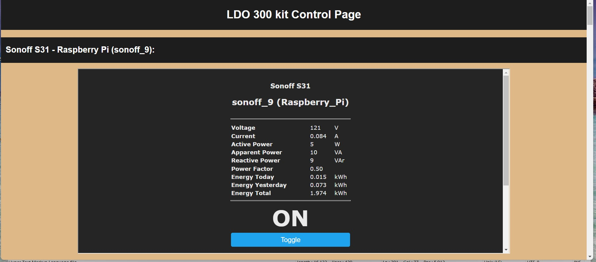

# Klipper backup of My Different 3D Printer Control Web Pages

I wanted a way to control the Tasmota power modules on my 3D printers and a way to access different
URL addresses that help me configure the corresponding printer.

This repository will contain the Index HTML files for these control web pages along with pictures of the web pages.

Resources I used to install the NGINX web server and the Mosquito broker:
1. [Install Mosquitto MQTT Broker on Raspberry Pi](https://randomnerdtutorials.com/how-to-install-mosquitto-broker-on-raspberry-pi/)
2. [Testing Mosquitto Broker and Client on Raspberry Pi](https://randomnerdtutorials.com/testing-mosquitto-broker-and-client-on-raspbbery-pi/)
3. [Build your own Raspberry Pi NGINX Web Server](https://pimylifeup.com/raspberry-pi-nginx/)
4. [SAMBA Setup - GCODE File Network Share Setup](https://github.com/rkolbi/voron2.4/tree/main/MY_V24-350#samba-setup---gcode-file-network-share-setup)

---
## Klipper backup of the LDO 300 Kit Build Web Page Server

The files for the LDO 300 kit is located in the [LDO300Kit folder](/LDO300Kit/)

Here is the first section of the LDO 300 Kit web page:

